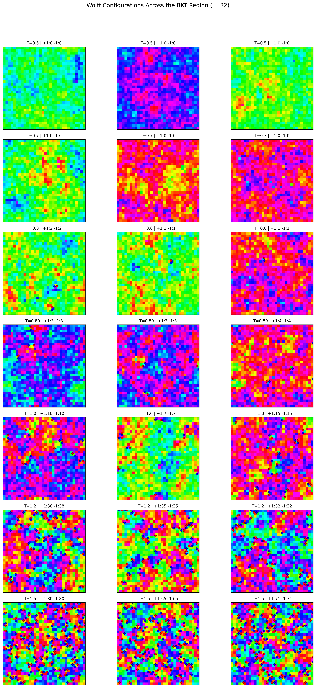
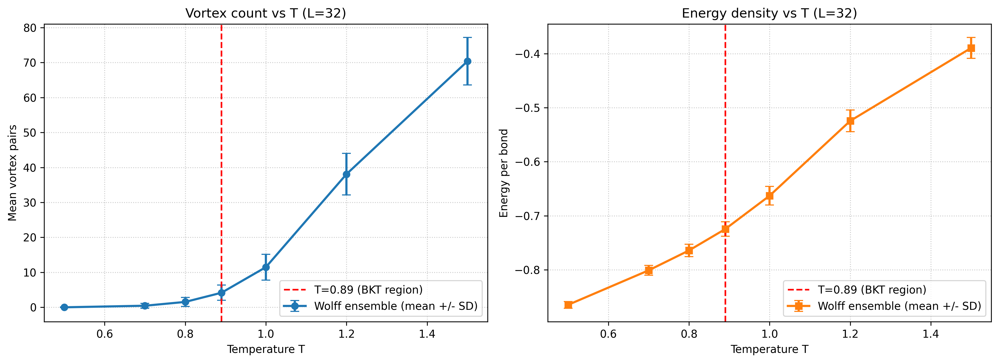
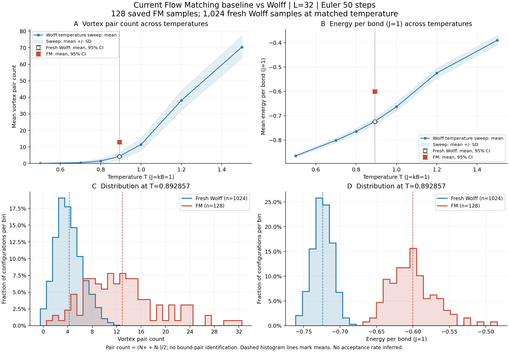

# Historical Wolff references and supervised Flow Matching

These notebooks document the earlier L=32 reference-building and supervised
Flow Matching experiments. The current data-free SPS implementation is a
separate method and uses a periodic CNN. The earlier model used a DiT with a
VorticityExtractor and Wolff training configurations. Because several components
changed together, these results are not a controlled comparison of DiT and CNN.

## What the three notebooks show

| Notebook | Purpose | Original inputs omitted from ordinary Git |
| --- | --- | --- |
| [01: data inspection](../../notebooks/01_data_inspection.ipynb) | Inspect an XY configuration, arrow angles and local plaquette winding numbers; compare three temperature examples. | The historical 10,000-sample main tensor and the two 100-sample low/high-temperature tensors. |
| [02: flow sampling](../../notebooks/02_flow_sampling.ipynb) | Generate samples with the historical supervised model and compare energy, vortex counts and spatial correlations with Wolff. | The original `best_dit_flow.pth` checkpoint, reference tensors and saved raw comparison arrays. |
| [03: temperature references](../../notebooks/03_multitemp_observables.ipynb) | Summarise seven temperatures and show example configurations; display the same historical FM diagnostic as Notebook 02. | Seven reference tensors, each with 1000 configurations, plus the inputs needed for the final FM comparison. |

The notebook code is retained; saved outputs are cleared to keep the repository
small. Exact byte copies of the executed notebooks remain in the local archive.
The figures below are selected saved results, so a reader can inspect the
findings without rerunning the notebooks.

## Seven-temperature Wolff reference

The scan contains L=32 configurations at T = 0.5, 0.7, 0.8, 0.89, 1.0, 1.2
and 1.5, with 1000 configurations per temperature. The gallery shows three
selected configurations at each temperature, rather than one representative
image. Arrows show spin directions; markers show positive and negative
plaquette winding numbers.



The statistics compare ensemble means of vortex counts and energy per bond.
Error bars in this historical temperature-scan plot are configuration-to-
configuration standard deviations (SD), not confidence intervals for the mean.
Lines connecting temperatures are visual guides; they do not represent
measurements at every intermediate temperature. A finite L=32 scan alone does
not establish the thermodynamic BKT transition.



## Matched-temperature diagnostic of the old model

The saved diagnostic uses J = kB = 1, L=32 and beta=1.12, so
T = 1/beta = 0.892857... . The fixed historical checkpoint generated 128 FM
samples using 50 Euler steps. An independently generated reference contains
1024 Wolff configurations from four chains. The old main training filename
rounded this temperature to `0.89`; the temperature-scan point at exactly 0.89
is background context, not this matched-temperature control.

| Observable | FM: 128 configurations | Wolff: 1024 configurations |
| --- | ---: | ---: |
| Mean vortex count under the pair convention | 12.9375 | 4.2314 |
| Mean energy per bond | -0.600430 | -0.723952 |

Here, the pair convention means `(N_plus + N_minus)/2`. It counts defects and
does not identify which vortex and antivortex form a physically bound pair.
Energy is divided by the 2048 distinct nearest-neighbour bonds of the periodic
32-by-32 lattice. The target is the correct distribution at the chosen
temperature; lower energy or fewer defects alone is not the objective.



The upper panels show reference temperature means with SD shading, plus FM and
new Wolff means with 95% sampling intervals. The lower panels show the two
matched-temperature distributions as proportions, accommodating their
different sample counts. The FM intervals use independent-start bootstrap
resampling; Wolff intervals resample blocks of 16 saved configurations within
each chain. These intervals depend on adequate equilibration and block length;
they do not include uncertainty from training or incomplete historical metadata.

The observed mismatch concerns this checkpoint and integration setting. It does
not prove that all Euclidean Flow Matching models fail, and it does not isolate
the effect of the DiT architecture or the VorticityExtractor. The latter remains
in the old model code for checkpoint compatibility; the current SPS network
does not use it.

The [saved summary](../../publication/results/legacy_fm_wolff.json) records the
sample counts, configuration, uncertainty estimates and finite reference-chain
checks. Its provenance is also recorded in the
[experiment manifest](../../publication/results/legacy_fm_wolff_manifest.json).

## Rerunning and reproducing

A clean clone contains the source and selected summaries, not the original
tensors or checkpoint. The notebooks therefore require additional experiment
files before all cells can run. The early low/high-temperature examples use
different files from the later seven-temperature scan.

For a new seven-temperature reference run, from the repository root:

```bash
python src/generate_wolff_sweep.py --T 0.5 0.7 0.8 0.89 1.0 1.2 1.5 --N 1000 --L 32 --burn-in 1000 --interval 50 --seed 0
```

This creates a new run; it does not recover the exact historical samples or
their random-number state. The historical generator does not capture a complete
execution environment or embedded tensor provenance.

The old supervised training source is `src/train_flow.py`; the matched-
temperature diagnostic source is `scripts/compare_fm_wolff.py`. To reproduce the
saved model diagnostic, supply the original checkpoint and required reference
tensors/raw arrays. Retraining produces a new model and must be reported as a
new experiment. Saved-run loaders check source fingerprints: changing source
files is not a way to reuse old results silently.
