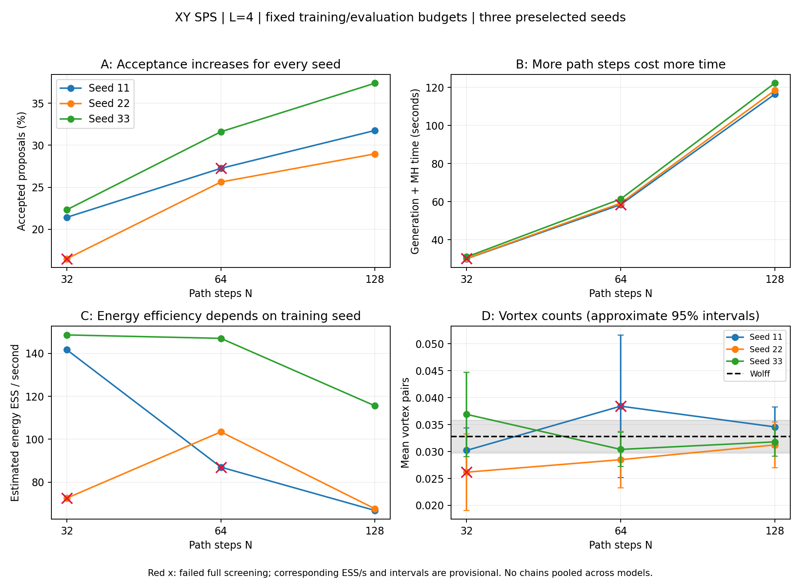
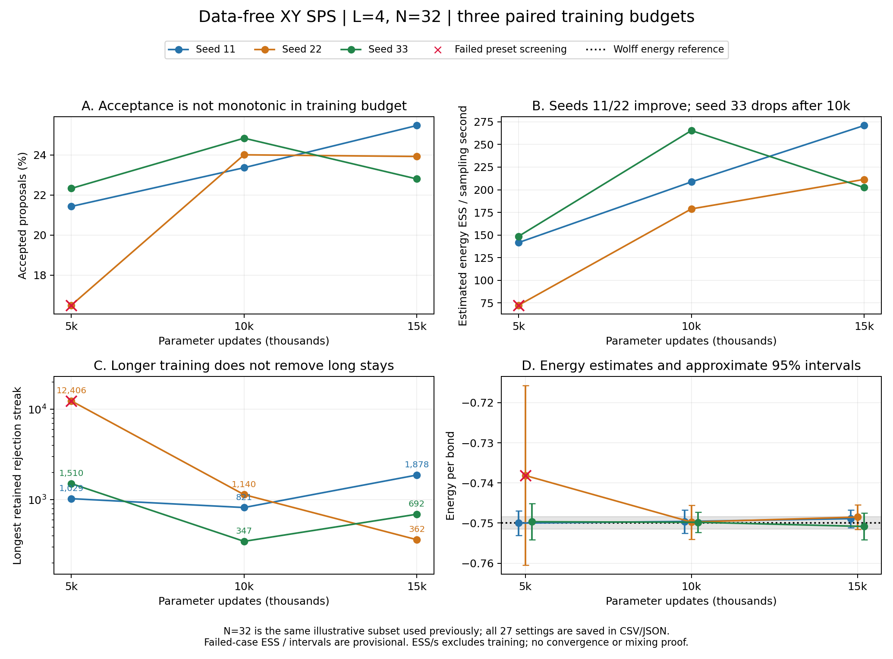
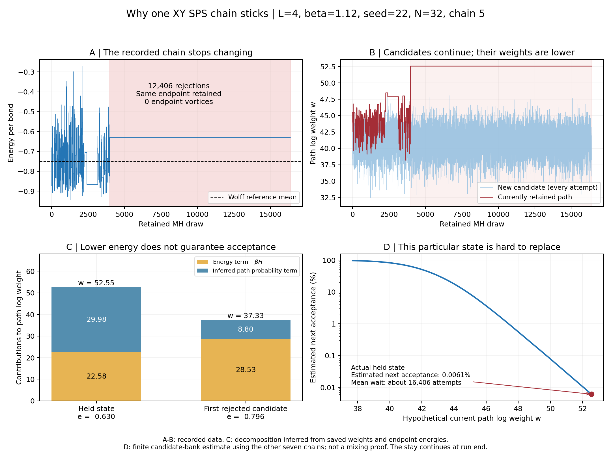

# Small-system results and limitations

The completed study tests data-free XY SPS on a `4 x 4` periodic lattice at `beta=1.12`. It examines generation-step count, training budget, and a concrete MH sticking event. The evidence supports a working small-system implementation with informative diagnostics; it does not demonstrate a solution to BKT critical slowing down or a speedup over Wolff.

## Experimental design

| Item | Setting |
|---|---|
| Physics | `L=4`, `J=1`, `beta=1.12`; energy normalized per bond |
| Training seeds | 11, 22, 33 |
| Training budgets | 5,000, 10,000, 15,000 parameter updates |
| Training paths | 32 steps; 64 paths per update; Adam learning rate `0.001` |
| Evaluation generation steps | `N=32,64,128`, all with duration 1 |
| Evaluation per setting | 8 chains; 4,096 burn-in attempts and 16,384 retained transitions per chain |
| Wolff reference | 4 chains; 2,000 initial cluster updates, then 4,096 retained configurations, separated by 20 cluster updates |

Each seed's model was continued from 5,000 to 10,000 to 15,000 updates, restoring optimizer and random-number states. Other training conditions, evaluation settings, and the Wolff reference were held fixed. Evaluation seeds were reused across training stages, so the comparisons are paired and correlated. The 27 settings are **not** 27 independent replications. Each checkpoint received one finite evaluation stream, rather than repeated evaluations establishing uncertainty in an efficiency improvement.

The third budget point was selected after inspecting the 10,000-update results. The entire three-budget sequence was not preregistered from the start. This round stopped at 15,000 updates, preserving every seed and unfavorable result.

## 1. More generation steps increased acceptance, but also cost more

This figure uses the 5,000-update models. The horizontal axis changes generation-step count while each model and total duration remain fixed. More steps mean smaller discrete increments and more neural-network evaluations; they also define different discrete proposal distributions.

For seed 33, increasing `N` from 32 to 128 increased observed acceptance from **22.3% to 37.4%**, a rise of **15.1 percentage points**. Sampling time rose from **31.0 to 122.2 seconds**, while estimated energy ESS per second fell from **148.6 to 115.6**. All three settings for this seed passed the selected-observable screening. Higher acceptance therefore did not imply higher effective energy sampling efficiency.

The seed-22, `N=32` and seed-11, `N=64` settings failed screening and remain in the summaries. Their efficiency estimates must not be used as reliable performance rankings. See [the generation-step CSV](../../publication/results/generation_steps.csv).

## 2. More training helped initially, then became seed dependent

The figure shows `N=32`, with training updates on the horizontal axis and colors identifying training seeds. Its panels show acceptance, estimated energy ESS per sampling second, longest retained rejection streak, and mean energy with approximate 95% intervals and the Wolff reference.

| Training seed, `N=32` | Energy ESS/s at 5,000 | At 10,000 | At 15,000 |
|---|---:|---:|---:|
| 11 | 141.7 | 208.7 | 270.9 |
| 22 | 72.5* | 178.8 | 211.4 |
| 33 | 148.6 | 265.4 | 202.4 |

`*` The seed-22, 5,000-update estimate failed screening; its ratio to a later estimate is not a reliable speedup factor.

Across all nine seed/step combinations, estimated energy ESS/s increased from 5,000 to 10,000 updates. From 10,000 to 15,000, it increased in six settings and decreased in all three seed-33 settings. Screening passed in **7/9, 9/9, and 9/9** settings at the three budgets. These are counts of selected diagnostic outcomes, not an estimated algorithm success probability.

At 15,000 updates and `N=32`, energy per bond was `-0.748891 ± 0.001115`, `-0.748493 ± 0.001545`, and `-0.750830 ± 0.001711` for seeds 11, 22, and 33, respectively. The common Wolff reference was `-0.749897 ± 0.000776`. These uncertainties are approximate standard errors, not 95% intervals.

Long rejection streaks did not disappear. For seed 11 at `N=32`, the longest observed streak changed from **821 to 1,878** between 10,000 and 15,000 updates even though energy ESS/s increased. A maximum streak and average information rate capture different features of the chain. Seed 33's later decrease in efficiency coincided with more concentrated proposal weights, but these observations do not identify a unique cause or prove overfitting.

The [training-budget CSV](../../publication/results/training_budget.csv) preserves all 27 settings, including costs, screening outcomes, importance-weight diagnostics, and rejection streaks. Approximate ESS estimates, rare-event sampling, and single-run GPU timings can fluctuate; the study does not establish convergence, a universal optimal budget, or statistically significant rankings. Cumulative recorded training cost at 15,000 updates was approximately **1,072–1,082 seconds per model**, separate from sampling ESS/s.

## 3. A high-relative-weight path caused a long MH stay

This diagnostic examines the worst observed retained stay in the seed-22, 5,000-update, `N=32` run. One chain accepted a state at retained draw 3,978 and then rejected **12,406 consecutive candidates**, through the end of its 16,384-record window. The stay is **right censored**: 12,406 is the observed number of rejections, not a completed waiting time. New proposals continued to be generated.

The retained path had log weight **52.554**, compared with **37.330** for the first rejected candidate. Although that candidate had a lower endpoint energy per bond (`-0.796` versus `-0.630`), its MH acceptance probability was only **2.45 x 10^-7**. Endpoint energy alone does not determine acceptance: the forward/backward path-probability terms also enter the weight.

Using 143,367 proposals from the other seven chains gave a conditional next-replacement probability estimate of approximately **0.0061%** for this particular retained state. This is distinct from the group's **16.5%** observed average acceptance. The conditional estimate depends on a finite proposal bank and may miss rare weight tails; it is not an independent test of equilibration.

The retained endpoint had **zero counted vortices**. This rules out the claim that this specific stay requires endpoint vortices. It does not rule out vortex effects in other configurations or along its unsaved intermediate path. The probability contribution in the figure is inferred algebraically from saved endpoint energies and total log weights; it was not independently recalculated from complete paths.

The recorded weights, random thresholds, repeated endpoints, and independent bond-energy calculation were audited. Those checks explain how the MH rule sustains this stay. They do **not** establish why training produced the relative-weight tail. The event was selected after observing the run, rather than as a preselected statistical test. Compact details are in [the mechanism JSON](../../publication/results/sticking_mechanism.json).

## Scope of the conclusion

The project has moved from supervised Wolff-data flow matching to a data-free SPS implementation, completed three-seed and training-budget comparisons, and connected a recorded failure mode to its acceptance rule. The useful lesson is to evaluate physical statistics, weight tails, chain dependence, effective information rate, and cost together.

The experiments cover one small lattice and one temperature. They do not provide system-size scaling, full-distribution convergence, a matched Wolff efficiency comparison, or evidence that BKT critical slowing down has been solved. Old DiT/flow-matching experiments changed several parts of the pipeline simultaneously, so they do not establish that attention or Euclidean flow matching is intrinsically unsuitable.

This public repository contains selected figures and compact result summaries. Original checkpoint and sample archives remain outside GitHub; existing analysis scripts that audit those runs require those originals. Complete intermediate paths were not saved. Running the supplied code can create a new experiment, but obtaining the same historical curves from the public summaries is different from independently rerunning training and validating every original path density.

See [the method](method.md) for the implemented objective, kernels, and MH construction, and [the bibliography](../../literature/references.bib) for method attribution.
